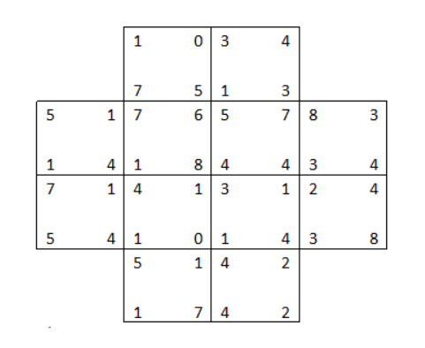
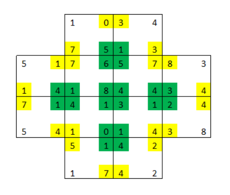
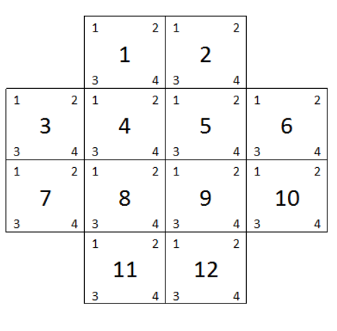
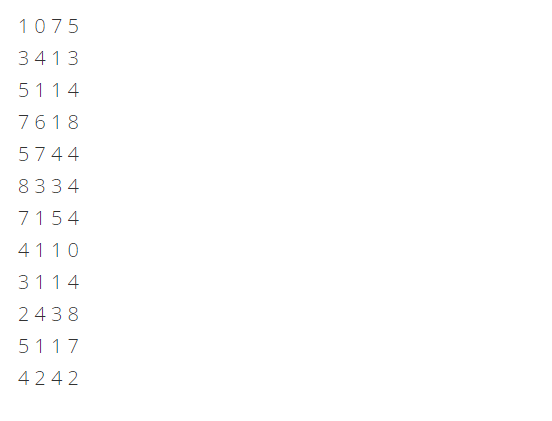
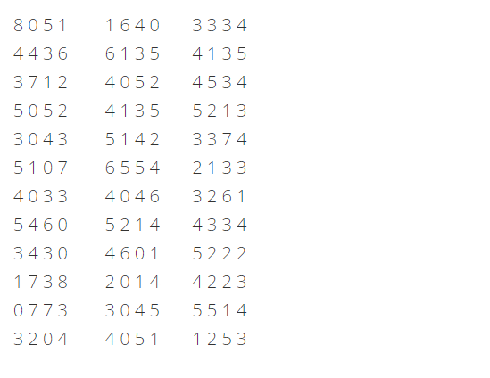

# ConeTestTask
Тестовое задание на позицию Java/Scala разработчика в компании Cone Center

### Задание
Есть 12 квадратов с произвольными числами от 0 до 9 в углах. Квадраты расставлены следующим образом:

(числа в углах даны для примера, далее как пример №1)

Квадраты надо поменять местами таким образом, чтобы сумма чисел четырех соприкасающихся углов была равна 10 (подкрашено зеленым), а двух или трех углов - не более 10 (подкрашено желтым).

Язык программирования – Scala http://www.scala-lang.org/ (мы не проверяем уровень знания Scala, мы лишь проверяем готовность к изучению нового языка).

На входе текстовый файл, одна строка – четыре числа – значения углов одного квадрата. Порядок строк и чисел в строке следующий:

Для примера №1 файл имеет следующий вид:

Окончательный результат перестановки выводится в консоль в том же формате. Если возможно несколько решений, то выводятся все решения, разделенные пустой строкой.

Оценивается не только правильность решения, но и стиль программирования.

Дополнительные примеры входного файла:

